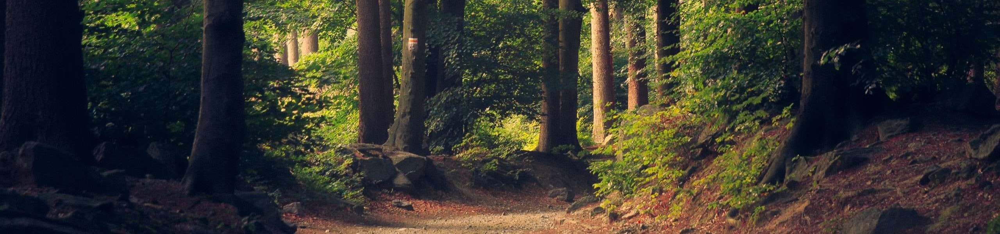

Hi! My name is Dan Mackley and I am a civil engineer, working in the construction industry. This digital garden is a way for me to record and share information for future civil engineers, and act as a way to document my learning!

## Get Started
### How it started
I first started the practice of better note-taking when I became interested in the [[Second Brain]] movement, brought to my attention by [[Ali Abdaal]] and [[Tiago Forte]]. I wanted a way to record and link my experience and knowledge as I started working towards my [[Professional Review]]. Over time this has grown to become a vital part of my [[Personal Knowledge Management]] system, and now I am wanting to expand this so others can use it too. I will treat this as a [digital garden](https://jzhao.xyz/posts/digital-gardening/), tending and growing notes as I gain more knowledge.

### How it works
This website contains a number of different pages, including methodologies, definitions, examples and reflections on civil engineering practice, some book summaries and other materials. 
To navigate around the site, simply click on something that looks interesting or use the search tool at the top to find something specific. 
Certain bigger topics will have a [Map of Content (MOC)](notes/Map%20of%20Content%20(MOC).md) which acts as a homepage of sorts to help direct you to useful information. You can use #tags to search for certain page types.

 - 👉 Get started with the [Civil Engineering MOC](notes/Civil%20Engineering%20MOC.md)
 - 💡 See my other interests [[Areas MOC]]

Navigation: [Civil Engineering MOC](notes/Civil%20Engineering%20MOC.md)

